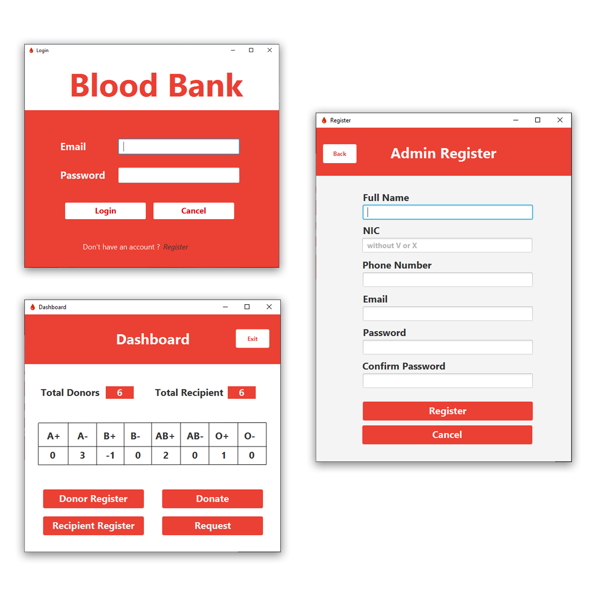
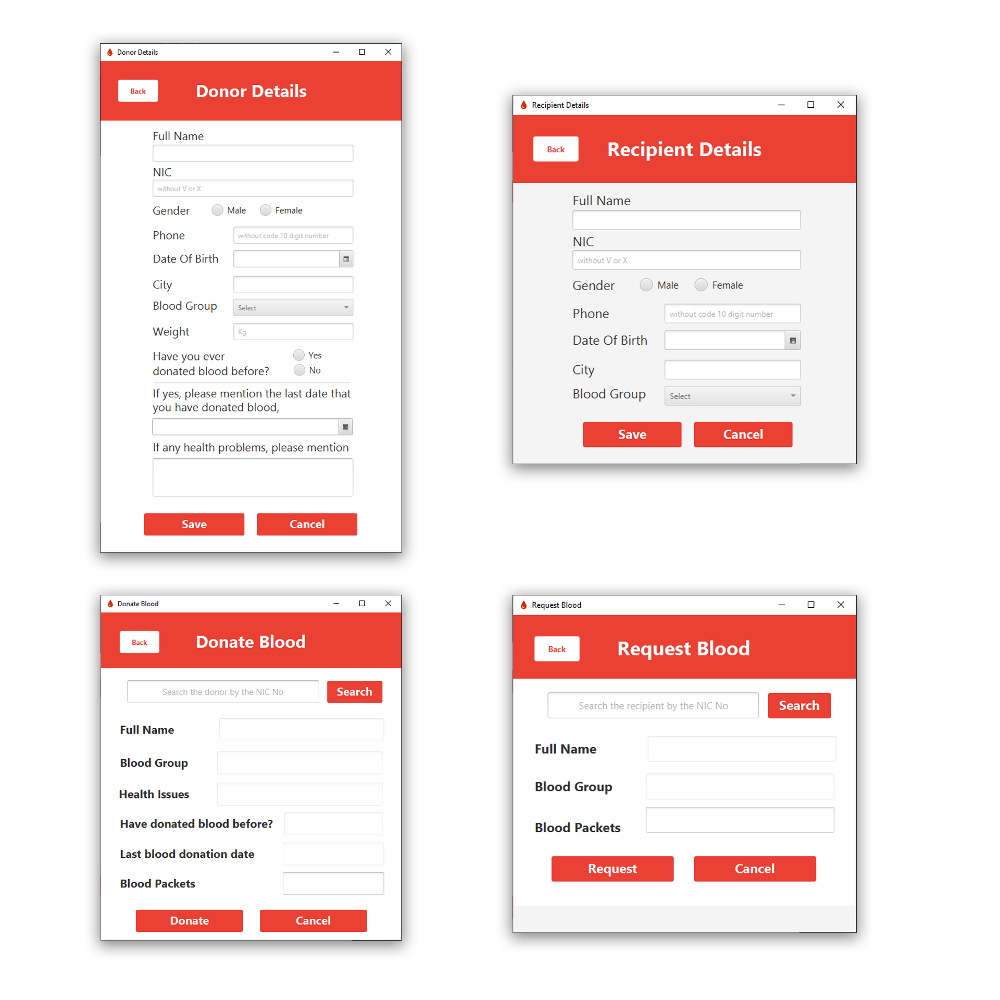

<h1 align="center">Blood Bank Application</h1>
<div align="center">
  <a href="https://github.com/DmetroSK/Blood-Bank-Application/stargazers"></a>
<a href="https://github.com/DmetroSK/Blood-Bank-Application/network/members"></a>
<a href="https://github.com/DmetroSK/Blood-Bank-Application/pulls"></a>
<a href="https://github.com/DmetroSK/Blood-Bank-Application/issues"></a>
<a href="https://github.com/DmetroSK/Blood-Bank-Application/graphs/contributors"></a>
<a href="https://github.com/DmetroSK/Blood-Bank-Application/blob/main/LICENSE"></a>
</div>
<br>

<details open="open">
  <summary>Table of Contents</summary>
  <ol>
    <li><a href="#about-the-project">About The Project</a></li>
    <li><a href="#built-with">Built With</a></li>
    <li><a href="#interface">Interface</a></li>
    <li><a href="#contributing">Contributing</a></li>
    <li><a href="#license">License</a></li>
    <li><a href="#support">Support</a></li>
     </ol>
</details>

## About The Project

This Java-based software is designed for Blood Bank employees to manage donor and recipient records efficiently. Through secure authentication, employees can log in and register new donors or recipients. The system also allows recording of how many blood packets a donor has donated or a recipient has requested, making blood stock management easier and more reliable.

## Built With

```sh
Java , JavaFX
```

## Interface




## Getting Start

First you clone this repo and open using intelj IDE and [Download](https://drive.google.com/file/d/1fp97rOllH0RzWBib7B4DlbbpAMbhOEGC/view?usp=sharing) this libraries and extract into project file. After import that libraries into project using Intelj IDE > File > Project Structure > Libraries > add this lib folder (javafx-sdk-17.0.0.1>lib) then again add this jar file (mysql-connector-java-8.0.26>mysql-connector-java-8.0.26.jar) after that you should config run using select main class.

After that you should [Download](https://github.com/DmetroSK/Blood-Bank-Application/blood.sql) this and import to your mysql database using create database name > blood

## Contributing

Contributions are what make the open source community such an amazing place to be learn, inspire, and create. Any contributions you make are **greatly appreciated**.

1. Fork the Project
2. Create your Feature Branch (`git checkout -b feature/AmazingFeature`)
3. Commit your Changes (`git commit -m 'Add some AmazingFeature'`)
4. Push to the Branch (`git push origin feature/AmazingFeature`)
5. Open a Pull Request

## License

Distributed under the MIT License. See `LICENSE` for more information.

## Support

Give a ⭐️ if this project helped you!
